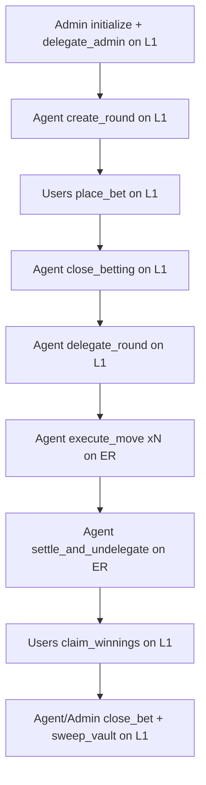

# MagicBet UX Flow (Final Implemented)

This doc reflects the current deployed and tested flow (`anchor test`: 4 passing).

## 1) Canonical Flow

1. `initialize(fund_amount)` on L1
2. `delegate_admin(agent)` on L1
3. `create_round(round_id, duration)` on L1 (status = `Active`)
4. Users call `place_bet(round_id, choice, amount)` on L1
5. Agent calls `close_betting(round_id)` on L1 (status = `InProgress`)
6. Agent calls `delegate_round(round_id)` on L1 (delegates `round` only)
7. Agent/crank calls `execute_move(round_id)` on ER until winner/limit
8. Agent calls `settle_and_undelegate(round_id)` on ER (commit + undelegate `round`)
9. Users call `claim_winnings(round_id)` on L1
10. Agent/admin calls `close_bet(round_id, user)` on L1
11. Agent/admin calls `sweep_vault(round_id)` on L1

## 2) Layer Split (L1 vs ER)

### L1 (value movement + account lifecycle)

- `place_bet`: creates/updates Bet PDA and transfers SOL `user -> vault`
- `close_betting`
- `claim_winnings`
- `close_bet`
- `sweep_vault`

### ER (data-only gameplay execution)

- `execute_move`
- `settle_and_undelegate`

Constraint followed: ER path does not do account creation or user lamport debit.

## 3) Flow Diagram

## 4) Why This Flow

- Avoids ER rejection (`InvalidAccountForFee`) from fee-payer lamport mutation.
- Keeps fast game ticks on ER where it matters (`execute_move` loop).
- Keeps all SOL movement and account creation on L1 for correctness.

## 5) User Experience

- Users sign to place bets during the betting window.
- During game execution, users mostly watch live state updates.
- After settlement, winners claim on L1.
